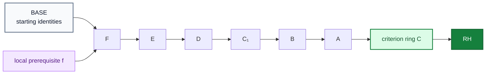
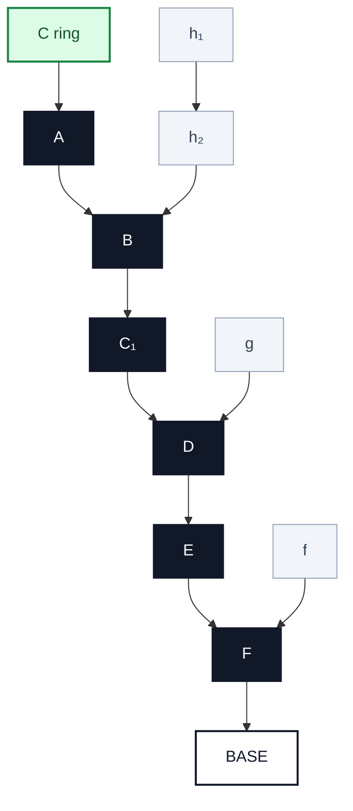

<div align="center">

# AWPI Φ/RH — Circular Proof Atlas

### A radial theorem-dependency atlas from `BASE` to the criterion ring `C`, with `RH` at the center

**Interactive artifact:** `Forwards_Criterion_Ring_MainPaths_LocalMemory_BASE.html`


</div>

---

## What this repository visualizes

This repository contains an interactive theorem atlas for the AWPI Φ/RH formalization. The graph is organized **radially** rather than as a conventional top-to-bottom dependency DAG:

- `RH` sits at the center.
- `C` is the criterion / constructor ring immediately around `RH`.
- Every theorem that feeds `C` generates one **main theorem path** running outward.
- The path terminates at `BASE`, the outer annulus containing the terminal starting identities and interfaces.
- Theorems that are needed locally but are not part of the chosen main path are placed beside that path as **local memory branches**.

The resulting picture separates the proof's primary theorem spine from the supporting identities that are only needed at specific points.



The important local-memory rule is visible in the small branch above: if `f` is needed only to establish `F`, then the atlas draws `f → F`. It does **not** propagate or reinject `f` into `E`, `D`, `C₁`, `B`, or `A` after `F` has already absorbed that requirement.

---

## Formal interface represented by the center

The theorem spine is displayed using the following interface:

```text
Forward:   C → RH
Reverse:   B ∧ RH → C
Therefore, under B:   C ↔ RH
```

Here `B` denotes the background assumptions used by the guarded reverse direction. The visualization treats repeated uses of background material locally: the same underlying assumption or theorem may appear more than once when that makes the dependency structure clearer.

The HTML atlas is a **visualization of the formal dependency graph**. It is not itself a proof kernel or a substitute for Rocq/Lean checking.

---

## Main-path / local-memory model

For each theorem that points directly toward `C`, the renderer chooses one longest/deepest continuation as the **main theorem path**. That path is the line you conceptually traverse from `C` outward to `BASE`.

Everything else in that theorem tree is still preserved, but it is moved out of the main corridor and attached as local memory to the exact theorem that consumes it.



This gives each side prerequisite a single semantic scope: **the theorem where it is actually used**.

---

## Current atlas snapshot

| Quantity | Current visualization |
|---|---:|
| Major paths pointing toward `C` | **17** |
| Original theorem / definition objects | **695** |
| Projected theorem placements | **6,824** |
| Main-path theorem dots | **287** |
| Main-path edges | **270** |
| Local-memory theorem dots | **6,537** |
| Local injections into the main paths | **1,200** |
| Internal local-memory edges | **5,337** |
| Terminal `BASE` identities / leaves | **5,388** |

Projected placements intentionally permit duplication. The same formal theorem may be rendered in multiple local contexts so that one branch does not have to cross the center or drag a dependency through unrelated proof stages.

---

## Visual grammar

| Element | Meaning |
|---|---|
| Green center | `RH` |
| Green annulus | criterion / constructor `C` |
| Dark theorem chain | main theorem path |
| Gray theorem dots | locally remembered supporting material |
| Teal attachment | local injection into the exact consuming theorem |
| Outer `BASE` annulus | terminal starting identities / interfaces |
| Larger, darker dot | theorem depends on more upstream projected material |
| Orange highlight | another rendered copy of the same underlying theorem |
| Blue highlight | currently selected dot |

The layout is static and deterministic. It deliberately avoids force-directed dynamics so that theorem locations remain stable between views and screenshots.

---

## Open the interactive atlas

Open the HTML file directly in a modern browser:

```text
Forwards_Criterion_Ring_MainPaths_LocalMemory_BASE.html
```

The atlas supports pan, zoom, theorem search, direct selection of the 17 major proof paths, toggling the main spines, and toggling local-memory material.

### GitHub Pages

GitHub does not execute an HTML application directly inside a README. To make the atlas interactive from the repository page, enable **GitHub Pages** for the repository and serve the HTML file from the selected Pages branch/folder.

After Pages is enabled, the atlas will be available at a URL of the form:

```text
https://<username>.github.io/<repository>/Forwards_Criterion_Ring_MainPaths_LocalMemory_BASE.html
```

You can then replace the placeholder below with the live Pages URL:

> **[Open the interactive proof atlas](./Forwards_Criterion_Ring_MainPaths_LocalMemory_BASE.html)**

For a Pages deployment, using `index.html` as a copy of the atlas gives the cleanest project URL.

---

## Reading the atlas

Start at the green `C` ring and choose one of the 17 dark theorem roots. Follow the dark spine outward. Any supporting theorem that is not on the chosen spine appears beside it in the same sector. Follow those gray branches only when you want to inspect what a particular spine theorem consumes. Continue along the dark line until it reaches the outer `BASE` region.

This is intentionally different from a graph in which every prerequisite is recursively threaded through every later theorem. Once a local prerequisite has discharged the theorem that needs it, the main path remembers only the resulting theorem.

---

## Why `BASE` exists

`BASE` is a visualization device for the terminal leaves of the dependency forest: starting identities, interfaces, local algebraic facts, and other prerequisites from which the displayed theorem paths are assembled.

It should not be read as one additional mathematical axiom. Its role is to make the direction of construction visually explicit:

```text
BASE  →  local identities  →  theorem spine  →  C  →  RH
```

---

## Repository provenance

The atlas is generated from the detailed theorem dependency material used by the forward/reverse AWPI Φ/RH proof packages. The underlying formal development remains the authoritative source for theorem statements, assumptions, and proof checking; this repository view is intended to make that structure inspectable at human scale.

---

<div align="center">

**A proof graph should show where an assumption is consumed — not drag it through every theorem that comes afterward.**

</div>
